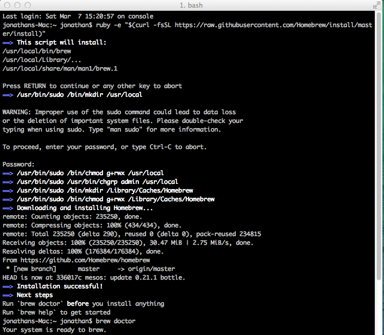

Homebrew at BOYB
================

###or

Using OSX for Bioinformatics
----------------------------

#What is OSX?

OSX is a Unix-like operating system created by Apple. Like traditional GNU/Linux is a set of software (the GNU suite) on top of the Linux kernel the base software executing on your computer, OSX is a set of software written by Apple on top of a basic operating system called Darwin. Fortunately for us, both Darwin and GNU/Linux share a design intended to be compatible with a set of standards describing how to main compatibility between different operating systems. This means that we are able to run software that has been designed to be POSIX-compatible, which includes most bioinformatics software. 

###A brief history of Unix-like systems


UNIX began as an operating system developed at Bell Labs in the 1970s, and has since formed the base for the majority of operating systems in use for general purpose computers (Almost everything except Windows). In recent history, Unix-like systems have split into three camps, commercial UNIX systems such as Oracle's Solaris or IBM's AIX, the open-source Linux operation system, and the open-source BSD family. OSX's Darwin derives from a derivative of BSD, and at a basic level most closely resembles modern operating systems like FreeBSD. 

Of these three camps, Linux is the most widely used system, and is the most commonly used for bioinformatics work, which can lead to problems using software that is primarily developed for a GNU/Linux environment and makes certain assumptions about extra software and libraries that are not part of the POSIX specification common between Linux/BSD/Darwin.

#Using OSX like a developer

For better or worse, OSX is an operating system increasingly designed for consumers, with very powerful, smooth graphical system use. On the other hand, Linux use remains heavily tied to the command line, despite attempts by companies such as Canonical to create consumer-oriented Linux systems. The trend of bioinformatic software to lean heavily on  command-line interaction and distribution in the form of source code creates an immediate hurdle for OSX users. While Linux systems almost always either come with developer tools installed or easily accessible, OSX is not designed for this purpose.

##Command-line and compilation

Fortunately, Apple needs people to be able to actually develop software for their operating system, so they make available many of the tools needed for traditional POSIX development available easily. Apple has a very powerful, very extensive, and very large development suite known as Xcode freely available. One way to obtain all the software and compilers necessary is to download Xcode, although unless you intend to create OSX or iOS applications, I strongly recommend against downloading the many gigabytes of Xcode. Fortunately Apple releases just the [command-line tools](https://developer.apple.com/downloads/index.action) online in package form for free with an Apple ID account. They usually have updated tools every three months for the most recent two or three major versions of OSX.

###Making things simple

Installing the Xcode command-line tools sets you up with all you need to build most software from source manually or from makefiles. At this point however, you run into a distinct limitation of OSX compared to most commonly used distributions of GNU/Linux. If you want to download and compile a complicated software suite that depends on the presence of dozens of other software libraries not included in OSX, you will need to download, compile, and install all of those libraries yourself. (And hope you later don't need to install software that needs a different version!)

What OSX is missing is a Package Manager. Most Linux distributions are built around their package manager, whether it is apt for Ubuntu or Debian, yum for RedHat or CentOS, portage for Gentoo, or any of the many package managers. These pieces of software automatically handle downloading and compiling software, as well as managing dependencies between different pieces of software. 

##Homebrew to the rescue

There are three solutions you may come across that serve as package managers for OSX, MacPorts, Fink, and Homebrew. Of the three, I strongly recommend against Fink, which is based around Debian's apt-get system, and is in general more complex with very little upside over MacPorts or Homebrew. Deciding between Homebrew or MacPorts is slightly more complex, they can both work well and many people will quite passionately argue that one or other is complete crap and of course \*MacPorts/Homebrew\* is better in every way. To me, it comes down to a core difference in philosophy, MacPorts, based on BSD's ports, wants to replace everything with its own compiled versions, whereas Homebrew is more happy installing one program and the minimal amount of dependencies necessary to get it running. The first time I tried to install a small utility program and MacPorts wanted to download and compile an entire new Perl installation I gave up. Homebrew was developed as a reaction against the perceived complexity and messiness of MacPorts/Fink, and is really very simple and fast, and what I will recommend for most people. (At this point Homebrew vs MacPorts is a religious choice much like vi vs EMACS. [vi every time])

###Starting with Homebrew

As opposed to being based on an existing package manager like apt or ports, Homebrew is based around the idea of formulas written in Ruby and managed by git. **Homebrew works best when you give in and let it completely own your** `/usr/local/` **folder.** By default OSX reserves the `/usr/local/` folder for non-OS installed libraries and software, so the folder does not even exist in a fresh install of OSX, and will usually only exist if created by manual compilation or installation of command-line software. If you have already used the `/usr/local/` folder, I would recommend simply deleting everything you had previously installed and reinstalling it with Homebrew. Alternatively Homebrew is flexible and can be installed in any other folder, and will generally work well, but may be slightly more difficult to support if you are less familiar with Unix-like systems.

Before we begin, two warnings about the controversial philosophies behind Homebrew that differentiate it from MacPorts.

1. Homebrew works closely with existing software. OSX and Xcode include many frameworks and libraries and Homebrew will use them if available. This is good because you will not be out-of-sync with what Apple is doing, and this is bad because Apple is often very slow in updating these sorts of base software, so you may be running quite out of data software. (Homebrew has a special feature known as taps that let you bypass this problem simply)

2. Homebrew does not use sudo. As mentioned above, Homebrew works best when you allow it to create a special `/usr/local/` folder that is accessible for software installation without administrator privileges, which is good because it keeps things incredibly simple and streamlined, but is bad because it does not play well with manually installed software in the same folder. (Solutions: install everything using Homebrew, surprisingly easy even for non-Homebrew packages, or manually install in an alternative location)

Homebrew is incredibly easy to install. If you have not already installed Xcode or Xcode command line tools, opening up Terminal and typing 

```bash
$ gcc --version
```

will prompt you to install Xcode command line tools. Alternatively they are available for manual download at https://developer.apple.com/downloads/index.action

Once you have Command-Line Tools installed one way or another, installation of Homebrew is as simple as

```bash
$ ruby -e "$(curl -fsS http://gist.github.com/raw/323731/install_homebrew.rb)"
```

This starts up an interactive installation process, which will be the first and last time you need to use sudo with Homebrew. 

###Making sure you are starting off of the right footing with Dr. Homebrew

Once you have Homebrew installed, especially if you have previously used your system with Fink/MacPorts or manual installation of POSIX software, you will want to run `brew doctor` to verify that your system is set up properly.

Hopefully you don't have any problems, if you do there is usually a good amount of documentation available on Homebrew's Github page to help solve your problem. Due to the relative homogeneity of OSX installations compared to the myriad varieties of Linux, if you have a problem it has probably already been solved on StackOverflow.



###Using brew

Installing software using Homebrew is incredibly simple, as easy as typing `brew install wget`. If Homebrew needs to install dependencies it should prompt you to verify installation of those. 

You will may not know the exact format of the name needed to install your favorite software (although it is usually pretty simple!) so you can easily search all the base or installed Homebrew formulas using the `brew search` function. 

```bash
$ brew search mysql
automysqlbackup		     mysql			  mysql-cluster		       mysql-connector-c++	    mysql-proxy			 mysql-search-replace
groonga-normalizer-mysql     mysql++			  mysql-connector-c	       mysql-connector-odbc	    mysql-sandbox		 mysqlreport
```

Additionally, [http://searchbrew.com/](http://searchbrew.com/) is available to search most available formulas with descriptions of each package. All formulas are also easily visible directly from the [source Github page](https://github.com/Homebrew/homebrew/tree/master/Library/Formula). 

Once you find anything that interests you, you can get more information about a package using `brew info`.

```bash
$ brew info wget 
wget: stable 1.16.2 (bottled), HEAD
https://www.gnu.org/software/wget/
/usr/local/Cellar/wget/1.15_2 (9 files, 908K)
  Poured from bottle
/usr/local/Cellar/wget/1.16.1 (9 files, 940K) *
  Poured from bottle
From: https://github.com/Homebrew/homebrew/blob/master/Library/Formula/wget.rb
==> Dependencies
Build: xz ✘
Recommended: openssl ✔
Optional: libressl ✘, pcre ✔
==> Options
--with-debug
	Build with debug support
--with-iri
	Enable iri support
--with-libressl
	Build with libressl support
--with-pcre
	Build with pcre support
--without-openssl
	Build without openssl support
--HEAD
	Install HEAD version
```

Homebrew works based on git, and in order to keep things simple does not ever create any automated tasks. All available formula are stored in a special folder in `/usr/local/Library` which happens to also be a local git repository. In order to keep your formulas up to date and to pull new formulas you need to `brew update`.

```bash
$ brew update
Updated Homebrew from 9c9f2a53 to 336017cd.
==> Updated Formulae
cfengine     chromaprint  ejabberd     ffmpeg	    fossil	 ghostscript  git	   glib		javarepl     libmagic	  mesos	       passenger    pbzip2	 pipemeter    unarj
```

This can easily be automated using your favorite automation system such as cron, launchd, or even iCal.

###Homebrew and language packages

Homebrew supports installation of languages such as Ruby, Perl, Python, or R that may or may not be included in OSX itself. It will install these in its standard `/usr/local/` folder, separate from the OSX Frameworks folder. In general Homebrew will avoid duplication relative to these languages native package managers. For instance, Homebrew will rarely install anything included in Python's `pip` or R's `install.packages` or Bioconductor. It is recommended to install the languages package manager, for instance install Pip on Homebrew's Python and use that to install Numpy or Biopython. In almost all situations these package managers will automatically detect Homebrew-installed libraries and build packages properly. 

###Managing Homebrew Paths
By default Homebrew installs all software binaries in `/usr/local/bin`. By default the OSX PATH is

```
/usr/bin:/bin:/usr/sbin:/sbin:/usr/local/bin
```

meaning that OSX provided tools will take priority over Homebrew-installed utilities. Without any modifications, if you wished to install Homebrewed Perl and run that, you would need to call `/usr/local/bin/perl` to avoid calling system Perl. If you wish to rearrange your path, for instance to automatically call Homebrewed software, you can set your path in `~/.bashrc` in your user home folder.

#Advanced Homebrew

###Taps

Probably the most important advanced use of Homebrew for our purposes are Taps. (Are you seeing a theme in Homebrew terminology by this point?). As we saw, Homebrew is at its base a collections of scripts and formulas held in a git repository, heavily integrated with Github. In additional to the several thousand base formulas included in the main Homebrew repository, there are thousands more which have been judged of too limited appeal to include in the main repo. Instead, Homebrew encourages the creation of additional formula repositories containing complementary formulas. The biggest and most used of these additional repositories is homebrew/science.

###Using a Tap

Gaining access to all of the software available in alternative repos like homebrew/science is as simple as 

```bash
$ brew tap homebrew/science
Cloning into '/usr/local/Library/Taps/homebrew/homebrew-science'...
remote: Counting objects: 9154, done.
remote: Compressing objects: 100% (17/17), done.
remote: Total 9154 (delta 6), reused 0 (delta 0), pack-reused 9137
Receiving objects: 100% (9154/9154), 2.41 MiB | 0 bytes/s, done.
Resolving deltas: 100% (5106/5106), done.
Checking connectivity... done.
Tapped 440 formulae
```

Once tapped, all of the formula are available from all of the standard `brew` commands like `install`, `info`, and `search`.

###Other Taps of interest

Other interesting taps (from the main documentation)
*   [homebrew/dupes](https://github.com/Homebrew/homebrew-dupes)
    - Need GDB or a newer Tk? System duplicates go here.

*   [homebrew/versions](https://github.com/Homebrew/homebrew-versions)
    - Need e.g. older or newer versions of Postgresql? Older versions of GCC?

*   [homebrew/games](https://github.com/Homebrew/homebrew-games)
    - Game or gaming-emulation related formulae.

*   [homebrew/apache](https://github.com/Homebrew/homebrew-apache)
    - A tap for Apache modules, extending OS X's built-in Apache. These brews may require unconventional additional setup, as explained in the caveats.

*   [homebrew/head-only](https://github.com/Homebrew/homebrew-head-only)
    - A tap for brews that only have unstable, unreleased versions.

*   [homebrew/boneyard](https://github.com/Homebrew/homebrew-boneyard)
    - Formula are not deleted, they are moved here.

*   [homebrew/binary](https://github.com/Homebrew/homebrew-binary)
    - Precompiled binary formulae.

###Brewing

Creating and editing Homebrew formulas is fairly simple. To take a look at a fairly simple formula take a look at the Bowtie2 formula

```bash
$ brew edit bowtie2
```

```ruby
require 'formula'

class Bowtie2 < Formula
  homepage "http://bowtie-bio.sourceforge.net/bowtie2/index.shtml"
  #doi "10.1038/nmeth.1923"
  head "https://github.com/BenLangmead/bowtie2.git"

  url "https://github.com/BenLangmead/bowtie2/archive/v2.2.4.tar.gz"
  sha1 "ab9f1bef67a3a704fd9b91d09dee5c74c2bc6159"

  def install
    system "make"
    bin.install %W[bowtie2
                   bowtie2-align-l bowtie2-align-s
                   bowtie2-build   bowtie2-build-l   bowtie2-build-s
                   bowtie2-inspect bowtie2-inspect-l bowtie2-inspect-s]

    doc.install %W[AUTHORS LICENSE MANUAL
                   NEWS README TUTORIAL VERSION]

    share.install %W[example scripts]
  end

  test do
    system "bowtie2-build", "#{share}/example/reference/lambda_virus.fa", "lambda_virus"
    assert File.exist?("lambda_virus.1.bt2")
  end
end
```

This formula takes advantage of many of the commonly used features of Homebrew formulas. This is written in a Ruby-based domain-specific language (DSL). The first line pulls the Ruby code necessary to interpret the remainder as a Homebrew Formula. Then it creates a Ruby class with the name of the formula, and inherits from Formula. The first attributes are defining traits of this Formula, the homepage, url, and hash of the download are all required, while the head attribute points to a git repository for optional installation direct from the repository instead of a numbered release.

Then the install section handles the actual building and installation of the problem. `system` lines directly send the quoted text to the bash shell, in this case calling GNU Make to build the software. Many programs that this point will simply include a line `system "make install"`, relying on the makefile to install all of the required files, which Homebrew will then redirect to install in the correct folder and then symlink all of the installed binaries from its folder into `/usr/local/bin`. Bowtie2 does not come with a makefile that handles installation, so this Formula uses the *.install functions to transfer specific binaries, documentation, and additional data files to the correct Homebrew directories.

All Homebrew recipes must now include a test section, which is run after installation to verify that the software installed and runs correctly. Many time this is done by simply calling the main binary and checking that it does not return an error code. In the case of Bowtie2, the test uses another `system` line to run `bowtie2-build` to generate an index for the included lambda genome data, and checks that an index file is made.

Editing recipes is as simple as opening the .rb formula file and editing it in place. Since the Homebrew folder is simply a git repository, it can handle merging your changes with upstream changes. If you want to contribute new formulas or changes, it simple git use to fork the Github repository, `brew tap` your own repo, and then pull request your changes for the main repository or tap.

###Creating your own brew

Creation of your own Formulas is also simple. In general what you want to do is either run `brew create [name]` or directly create a [name].rb file in the Formulas folder, and use a simple recipe as a template. Fill in the attributes at the top, either put in the same `system` commands you would use to install the software manually as from the software's instructions, even including `make install`, or use some of the `*.install` functions to include only the files you are interested in, and finally a test can be as simple as `system "[main binary]"`. 

Extensive information and guides on how to create good Homebrew Formulas and troubleshooting are available on Github. 

[https://github.com/Homebrew/homebrew/blob/master/share/doc/homebrew/Formula-Cookbook.md#formula-cookbook](https://github.com/Homebrew/homebrew/blob/master/share/doc/homebrew/Formula-Cookbook.md)

## Other Homebrew tips/tricks/info

### Some details on how Homebrew installs things

Homebrew keeps each piece of software separate from both other Homebrew-installed software and OSX-provided software, by storing each installation in a folder in `/usr/local/Cellar/` and then symlinking the installed files into the main `/usr/local/` folder. You can investigate the structure of an installed package by calling `brew ls`:

```bash
$ brew ls bowtie2
/usr/local/Cellar/bowtie2/2.2.4/bin/bowtie2
/usr/local/Cellar/bowtie2/2.2.4/bin/bowtie2-align-l
/usr/local/Cellar/bowtie2/2.2.4/bin/bowtie2-align-s
/usr/local/Cellar/bowtie2/2.2.4/bin/bowtie2-build
/usr/local/Cellar/bowtie2/2.2.4/bin/bowtie2-build-l
/usr/local/Cellar/bowtie2/2.2.4/bin/bowtie2-build-s
/usr/local/Cellar/bowtie2/2.2.4/bin/bowtie2-inspect
/usr/local/Cellar/bowtie2/2.2.4/bin/bowtie2-inspect-l
/usr/local/Cellar/bowtie2/2.2.4/bin/bowtie2-inspect-s
/usr/local/Cellar/bowtie2/2.2.4/share/doc/ (7 files)
/usr/local/Cellar/bowtie2/2.2.4/share/example/ (11 files)
/usr/local/Cellar/bowtie2/2.2.4/share/scripts/ (45 files)
```

As we saw earlier from the bowtie2.rb Formula, these are the files specified by `bin.install`, `share.install`, and `doc.install`, installed automatically in their place. Conversely:

```bash
$ ls -la /usr/local/bin/bowtie*
lrwxr-xr-x  1 jonathan  admin    35B Dec 19 11:19 /usr/local/bin/bowtie2@ -> ../Cellar/bowtie2/2.2.4/bin/bowtie2
lrwxr-xr-x  1 jonathan  admin    43B Dec 19 11:19 /usr/local/bin/bowtie2-align-l@ -> ../Cellar/bowtie2/2.2.4/bin/bowtie2-align-l
lrwxr-xr-x  1 jonathan  admin    43B Dec 19 11:19 /usr/local/bin/bowtie2-align-s@ -> ../Cellar/bowtie2/2.2.4/bin/bowtie2-align-s
lrwxr-xr-x  1 jonathan  admin    41B Dec 19 11:19 /usr/local/bin/bowtie2-build@ -> ../Cellar/bowtie2/2.2.4/bin/bowtie2-build
lrwxr-xr-x  1 jonathan  admin    43B Dec 19 11:19 /usr/local/bin/bowtie2-build-l@ -> ../Cellar/bowtie2/2.2.4/bin/bowtie2-build-l
lrwxr-xr-x  1 jonathan  admin    43B Dec 19 11:19 /usr/local/bin/bowtie2-build-s@ -> ../Cellar/bowtie2/2.2.4/bin/bowtie2-build-s
lrwxr-xr-x  1 jonathan  admin    43B Dec 19 11:19 /usr/local/bin/bowtie2-inspect@ -> ../Cellar/bowtie2/2.2.4/bin/bowtie2-inspect
lrwxr-xr-x  1 jonathan  admin    45B Dec 19 11:19 /usr/local/bin/bowtie2-inspect-l@ -> ../Cellar/bowtie2/2.2.4/bin/bowtie2-inspect-l
lrwxr-xr-x  1 jonathan  admin    45B Dec 19 11:19 /usr/local/bin/bowtie2-inspect-s@ -> ../Cellar/bowtie2/2.2.4/bin/bowtie2-inspect-s
```

You can uninstall Homebrewed formula by `brew uninstall` to completely delete the files from `/usr/local/Cellar`, although you can also simply remove the symlinks by using `brew unlink` if you want to have the software available but prevent conflicts in the system-accessible `/usr/local` folders.

### Incompatible software

Fortunately, the vast majority of bioinformatics or POSIX utility software will play well with OSX. Many of the commonly used pieces of software that are slightly incompatible with OSX or will not install with default settings have Homebrew Formula that apply OSX compatibility patches automatically, so by using MacPorts or Homebrew you are a step up over trying to install things manually. 

There are some programs however, that persist in failing to build on OSX. The most common issue that I have come across with obscure libraries or utilities is use of incompatible Pthreads multithreading libraries that are Linux-specific and will not function on OSX or BSD. If these are currently maintained pieces of software, developers can often be convinced to make slight changes to their headers to use BSD-compatible threading libraries. If the software is not currently maintained, you may be out of luck unless you are a more talented C programmer than I am. I have only come across this problem once, and I was able to find an alternative library that performed the same function and was currently maintained and BSD-compatible! 

The Homebrew StackOverflow and Github pages are excellent resources for help building incompatible software for OSX, for those situations where there is difficulty.

### Using GNU utilities instead of BSD

As a result of the origin of the Darwin system as a fork of an early BSD derivative NeXTSTEP, many of the commonly used utilties, like `ls`, `cat`, `grep`, and `awk`, included with OSX are very old versions of the BSD utilities, and are missing many of the more powerful features of those utilities including with modern GNU/Linux operation systems.

```bash
$ brew install coreutils
```

GNU Coreutils includes the very basic software needed for POSIX systems. By default Homebrew will build and install the latest versions, and put them in two places. It will symlink all the binaries to the usual `/usr/local/bin`, however to avoid shocking unsuspecting users, these symlinks are all prefixed with the letter 'g', to signify that they are the GNU versions. Additionally Homebrew symlinks these binaries to the `{brew_prefix}/libexec/gnubin` folder with their default names. If you would like your shell to always use the GNU versions of these utilities, you can add 

```bash
export PATH="$(brew --prefix coreutils)/libexec/gnubin:$PATH"
```

To your `~/.bashrc`. This is a good time to remind you that if you would like other Homebrew installed binaries to be automatically used you should prepend `/usr/local/bin/` to your path as well. Other commonly used GNU utilities can be installed. Some of these may require you to tap homebrew/dupes.

```bash 
brew install binutils
brew install diffutils
brew install ed --default-names
brew install findutils --with-default-names
brew install gawk
brew install gnu-indent --with-default-names
brew install gnu-sed --with-default-names
brew install gnu-tar --with-default-names
brew install gnu-which --with-default-names
brew install gnutls
brew install grep --with-default-names
brew install gzip
brew install screen
brew install tmux
brew install watch
brew install wdiff --with-gettext
brew install wget
brew install bash
brew install make
brew install emacs
brew install vim
brew install nano
```

The `--default-names` option prevents Homebrew from prefixing the 'g' onto the binary names for those formula. (List of utils from [here](https://www.topbug.net/blog/2013/04/14/install-and-use-gnu-command-line-tools-in-mac-os-x/))

If you like to use `man` you can prepend `/usr/local/opt/coreutils/libexec/gnuman` to your MANPATH variable in `~/.bashrc` to have these manfiles automatically available.

##Other OSX Tips

###X11 Based software

Some bioinformatics software includes graphics subsystems that rely on X11 or X.Org X Windowing System. Fortunately Homebrew includes very good support for XQuartz, an implementation of the X.Org Windowing System for the OSX Window Manager. You must install this manually using a standard OSX package installer, and keep it updated yourself, but Homebrew *will* prompt you to do so when necessary.

###Bash config files

If you want to modify your shell, OSX confusingly provides several options. By default OSX uses bash, for good reason, but this has two places that you can provide commands to run for new shells, `.bashrc` and `.bash_profile`. These two files are for two different types of shells, non-login and login shells. When you log into a new shell/terminal window OSX runs `.bash_profile` to set up your shell before the command prompt. Non-login shells on the other hand, for instance a new terminal window in ssh after already being logged in, will run `.bashrc`. Confusingly the Terminal.app program that ships with OSX, as well as many of the other GUI apps like iTerm2, create a new login shell for every window/tab, calling `.bash_profile` each time. A suggestion from [Josh Staiger](http://www.joshstaiger.org/archives/2005/07/bash_profile_vs.html) that I use is to modify your PATH settings in `.bashrc` and add the following to your `.bash_profile`.

```bash
if [ -f ~/.bashrc ]; then
   source ~/.bashrc
fi
```

If you do this make sure to never call `.bash_profile` from inside your `.bashrc` or you get an infinite loop that will freeze your shell.

###Awesome things about OSX for bioinformatics

The biggest downside to using OSX for bioinformatics is the relative difficulty of installing and managing packages relative to Linux, but we have fixed that with Homebrew! Once we have everything installed we get to enjoy some of the things that make OSX great, like its user interface. 

Most of us will heavily be using scripting languages like Bash, Python, Perl, or R for our work. We can easily install and update all of these to the most up-to-date and powerful versions using Homebrew. Homebrew/Science provides us with access to many bioinformatics packages. There are great IDEs made for all of these (except Perl, why are you writing new Perl?) and the OSX Windowing and graphical user environment are far superior to anything available on Linux (and Windows is near-useless for bioinformatics). IDE's like Jetbrains IDEs (Free for academic use), RStudio, or SublimeText can all easily handle Homebrew installations seamlessly and look nicer and function more smoothly on OSX compared to Linux. (If you are tempted to say something snarky about vim/EMACS here, I'll dismiss you because you are almost certainly not actually interested in using OSX for this work!)

Another great feature of OSX that you will benefit from in this work is Time Machine. While there exist good automated backup solutions for Linux, they are far from user-friendly. Time Machine to a networked storage device can provide a lot more security for your work.