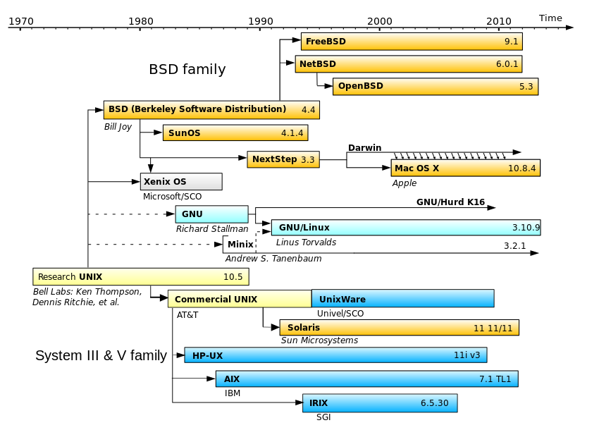

Homebrew at BOYB -or- Using OSX for Bioinformatics
==================================================

###What is OSX?

OSX is a Unix-like operating system created by Apple. Like traditional GNU/Linux is a set of software (the GNU suite) on top of the Linux kernel the base software executing on your computer, OSX is a set of software written by Apple on top of a basic operating system called Darwin. Fortunately for us, both Darwin and GNU/Linux share a design intended to be compatible with a set of standards describing how to main compatibility between different operating systems. This means that we are able to run software that has been designed to be POSIX-compatible, which includes most bioinformatics software. 

#A brief history of Unix-like systems



UNIX began as an operating system developed at Bell Labs in the 1970s, and has since formed the base for the majority of operating systems in use for general purpose computers (Almost everything except Windows). In recent history, Unix-like systems have split into three camps, commercial UNIX systems such as Oracle's Solaris or IBM's AIX, the open-source Linux operation system, and the open-source BSD family. OSX's Darwin derives from a derivative of BSD, and at a basic level most closely resembles modern operating systems like FreeBSD. 

Of these three camps, Linux is the most widely used system, and is the most commonly used for bioinformatics work, which can lead to problems using software that is primarily developed for a GNU/Linux environment and makes certain assumptions about extra software and libraries that are not part of the POSIX specification common between Linux/BSD/Darwin.

###Using OSX like a developer

For better or worse, OSX is an operating system increasingly designed for consumers, with very powerful, smooth graphical system use. On the other hand, Linux use remains heavily tied to the command line, despite attempts by companies such as Canonical to create consumer-oriented Linux systems. The trend of bioinformatic software to lean heavily on  command-line interaction and distribution in the form of source code creates an immediate hurdle for OSX users. While Linux systems almost always either come with developer tools installed or easily accessible, OSX is not designed for this purpose.

#Command-line and compilation

Fortunately, Apple needs people to be able to actually develop software for their operating system, so they make available many of the tools needed for traditional POSIX development available easily. Apple has a very powerful, very extensive, and very large development suite known as Xcode freely available. One way to obtain all the software and compilers necessary is to download Xcode, although unless you intend to create OSX or iOS applications, I strongly recommend against downloading the many gigabytes of Xcode. Fortunately Apple releases just the [command-line tools](https://developer.apple.com/downloads/index.action) online in package form for free with an Apple ID account. They usually have updated tools every three months for the most recent two or three major versions of OSX.

###Making things simple

Installing the Xcode command-line tools sets you up with all you need to build most software from source manually or from makefiles. At this point however, you run into a distinct limitation of OSX compared to most commonly used distributions of GNU/Linux. If you want to download and compile a complicated software suite that depends on the presence of dozens of other software libraries not included in OSX, you will need to download, compile, and install all of those libraries yourself. (And hope you later don't need to install software that needs a different version!)

What OSX is missing is a Package Manager. Most Linux distributions are built around their package manager, whether it is apt for Ubuntu or Debian, yum for RedHat or CentOS, portage for Gentoo, or any of the many package managers. These pieces of software automatically handle downloading and compiling software, as well as managing dependencies between different pieces of software. 

##Homebrew to the rescue

There are three solutions you may come across that serve as package managers for OSX, MacPorts, Fink, and Homebrew. Of the three, I strongly recommend against Fink, which is based around Debian's apt-get system, and is in general more complex with very little upside over MacPorts or Homebrew. Deciding between Homebrew or MacPorts is slightly more complex, they can both work well and many people will quite passionately argue that one or other is complete crap and of course \*MacPorts/Homebrew\* is better in every way. To me, it comes down to a core difference in philosophy, MacPorts, based on BSD's ports, wants to replace everything with its own compiled versions, whereas Homebrew is more happy installing one program and the minimal amount of dependencies necessary to get it running. The first time I tried to install a small utility program and MacPorts wanted to download and compile an entire new Perl installation I gave up. Homebrew was developed as a reaction against the perceived complexity and messiness of MacPorts/Fink, and is really very simple and fast, and what I will recommend for most people. (At this point Homebrew vs MacPorts is a religious choice much like vi vs EMACS. [vi every time])

#Starting with Homebrew

As opposed to being based on an existing package manager like apt or ports, Homebrew is based around the idea of recipes written in Ruby and managed by git. **Homebrew works best when you give in and let it completely own your /usr/local/ folder.** By default OSX reserves the /usr/local/ folder for non-OS installed libraries and software, so the folder does not even exist in a fresh install of OSX, and will usually only exist if created by manual compilation or installation of command-line software. If you have already used the /usr/local/ folder, I would recommend simply deleting everything you had previously installed and reinstalling it with Homebrew. Alternatively Homebrew is flexible and can be installed in any other folder, and will generally work well, but may be slightly more difficult to support if you are less familiar with Unix-like systems.

Before we begin, two warnings about the controversial philosphies behind Homebrew that differentiate it from MacPorts.

1. Homebrew works closely with existing software. OSX and Xcode include many frameworks and libraries and Homebrew will use them if available. This is good because you will not be out-of-sync with what Apple is doing, and this is bad because Apple is often very slow in updating these sorts of base software, so you may be running quite out of data software. (Homebrew has a special feature known as taps that let you bypass this problem simply)

2. Homebrew does not use sudo. As mentioned above, Homebrew works best when you allow it to create a special /usr/local/ folder that is accessible for software installation without adminstrator priveleges, which is good because it keeps things incredibly simple and streamlined, but is bad because it does not play well with manually installed software in the same folder. (Solutions: install everything using Homebrew, surprisngly easy even for non-Homebrew packages, or manually install in an alternative location)

Homebrew is incredibly easy to install. If you have not already installed Xcode or Xcode command line tools, opening up Terminal and typing 

```bash
gcc --version
```

will prompt you to install Xcode command line tools. Alternatively they are available for manual download at https://developer.apple.com/downloads/index.action

Once you have Command-Line Tools installed one way or another, installation of Homebrew is as simple as

```bash
ruby -e "$(curl -fsS http://gist.github.com/raw/323731/install_homebrew.rb)"
```

This starts up an interactive installation process, which will be the first and last time you need to use sudo with Homebrew. 

#Making sure you are starting off of the right footing with Dr. Homebrew

Once you have Homebrew installed, especially if you have previously used your system with Fink/MacPorts or manual installation of POSIX software, you will want to run `brew doctor` to verify that your system is set up properly.

Hopefully you don't have any problems, if you do there is usually a good amount of documentation available on Homebrew's Github page to help solve your problem. Due to the relative homogeneity of OSX installations compared to the myriad varieties of Linux, if you have a problem it has probably already been solved on StackOverflow.

#Using brew

Installing software using Homebrew is incredibly simple, as easy as typing `brew install wget`.