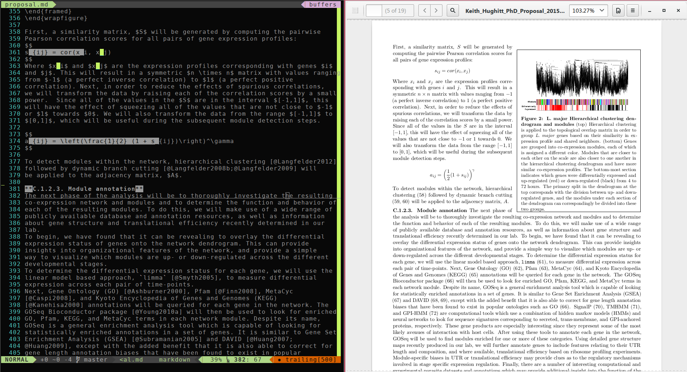

Writing reproducible manuscripts with RMarkdown
===============================================

[Keith Hughitt](mailto:khughitt@umd.edu)

September 10, 2015

Overview
--------

In this tutorial, we will explore the use of
[Markdown](http://daringfireball.net/projects/markdown/) for writing scientific
manuscripts. After discussing some of the strengths and weaknesses of using
Markdown over other approaches such as [LaTeX](http://www.latex-project.org/)
or [Google Docs](https://www.google.com/docs/about/), the basic steps of
putting togehter a Markdown-based paper will be described. Next, examples will
be provided on various aspects of Markdown manuscript generation, including:

- Figures and tables
- PDF generation using [pandoc](http://pandoc.org/getting-started.html)
- Bibliography management using [BibTeX](http://www.bibtex.org/) and the 
  [Pandoc citeproc extension](https://github.com/jgm/pandoc-citeproc)
- Extending Markdown documents with LaTeX.

Finally, to tie things together, we will discuss the use of
[knitr](http://yihui.name/knitr/) and [RMarkdown](http://rmarkdown.rstudio.com/) 
to create fully-reproducible manuscripts containing figures and tables
generated in [R](https://www.r-project.org/).

Why Markdown?
-------------

Before we get to far, it is worth considering the merits (and drawbacks) of
using Markdown for writing scientific manuscripts in the first place. 

### Advantages

- Its _easy_
- Plain-text
    - Simple, light-weight syntax
    - Use any editor
    - Unrendered markdown is nearly as readable as rendered
    - Can use version control to track history
- Markdown is becoming increasingly common (Github, Stack overflow, etc.)
- Easier to learn than LaTeX
- Supports embedded LaTeX and HTML
- Can be rendered to PDF, HTML, LaTeX, Word, etc.
- Easy bibliography management using Bibtex and Pandoc
- Can be readily combined with R to automatically generate plots and tables
  using R code.

### Disadvantages

- Collaborative writing not as straight-forward
    - For technically-savy, using Git to provides a simple way to collaborate 
      on a document
    - [Markx](https://github.com/yoavram/markx) is another potentially interesting
      collaborative Markdown editor aimed at scientists.
    - Still, useful features like reviewer comments will are missing.
- Less flexible than LaTeX or Word
    - Because of the simplicity of the Markdown syntax, the formatting options
      available are fairly limited.
    - In particular, image handling is very basic in Markdown.
    - This can be overcome, however, by using bits of embedded LaTeX.

Example 1: Basic Markdown document
----------------------------------

To begin, lets create a simply Markdown example to demonstrate how to include 
figures, tables, and formulas.

[examples](examples/01-simple-markdown-document.md)

Further reading
---------------

**Markdown-based manuscripts**

1. [Simple template for scientific manuscripts in R markdown](http://www.petrkeil.com/?p=2401)
2. [Writing academic papers in Markdown using Sublime Text and Pandoc](http://nikolasander.com/writing-in-markdown/)
3. [Writing Scientific Papers Using Markdown](https://danieljhocking.wordpress.com/2014/12/09/writing-scientific-papers-using-markdown/)
4. [Markdown-for-Manuscripts](https://github.com/djhocking/Markdown-for-Manuscripts)

