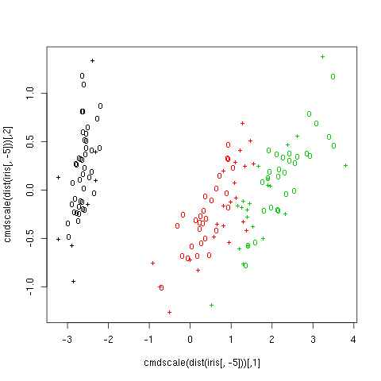

Overview
========

This is a simple example demonstrating the use of external figures, tables, and
formulas in a Markdown document.

There are actually multiple Markdown standards in common use. In additional to
the [main standard](http://daringfireball.net/projects/markdown/), there are also
[extensions](https://en.wikipedia.org/wiki/Markdown#Extensions) to the standard
from from [Github](https://help.github.com/articles/github-flavored-markdown/), 
[Pandoc](http://pandoc.org/README.html#pandocs-markdown), etc. Here, we will
make use of some of the extended table support in the Pandoc markdown
extension.

### Table example

Below is an example table in the Markdown pipe-style table. This is the default
output from the knitr `kable` function.

|    | Sepal.Length| Sepal.Width| Petal.Length| Petal.Width|Species    |
|:---|------------:|-----------:|------------:|-----------:|:----------|
|1   |          5.1|         3.5|          1.4|         0.2|setosa     |
|2   |          4.9|         3.0|          1.4|         0.2|setosa     |
|3   |          4.7|         3.2|          1.3|         0.2|setosa     |
|50  |          5.0|         3.3|          1.4|         0.2|setosa     |
|51  |          7.0|         3.2|          4.7|         1.4|versicolor |
|52  |          6.4|         3.2|          4.5|         1.5|versicolor |
|53  |          6.9|         3.1|          4.9|         1.5|versicolor |
|100 |          5.7|         2.8|          4.1|         1.3|versicolor |
|101 |          6.3|         3.3|          6.0|         2.5|virginica  |
|102 |          5.8|         2.7|          5.1|         1.9|virginica  |
|103 |          7.1|         3.0|          5.9|         2.1|virginica  |
|104 |          6.3|         2.9|          5.6|         1.8|virginica  |

Table: Subset of the Iris dataset.

For more examples of table styles supported by Pandoc Markdown, see the
[Pandoc
Documentation](http://pandoc.org/README.html#tables).

### Figure example

