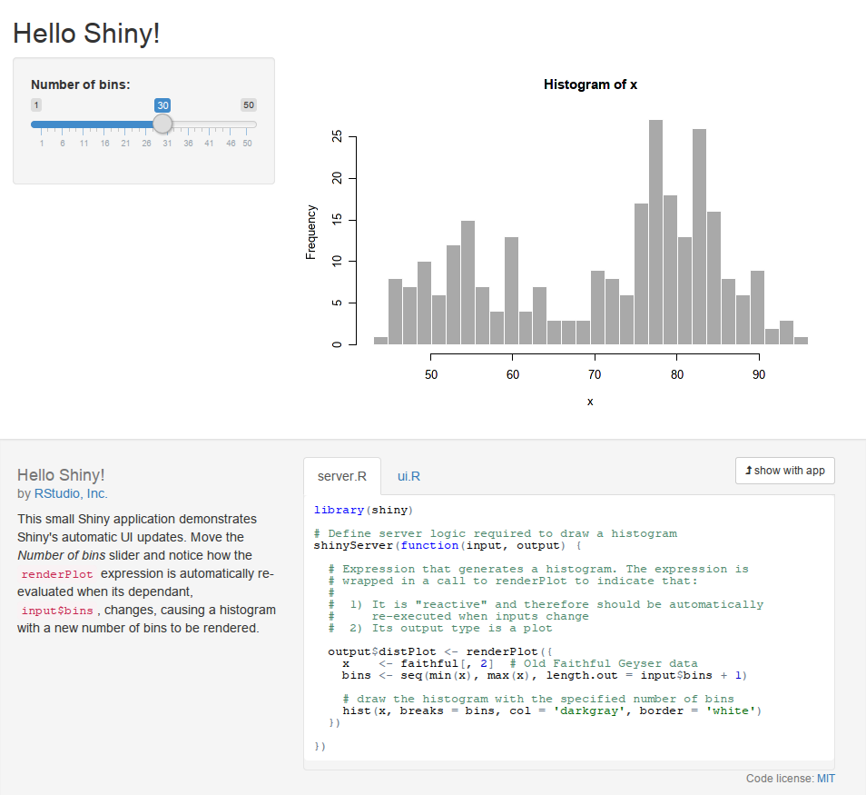

Interactive data analysis with Shiny
====================================

[Keith Hughitt](mailto:khughitt@umd.edu)
February 2015

TODO
----

- ggvis
- shiny server
- shinyapps.io

Overview
--------

In this tutorial we will explore the use of the [Shiny](http://shiny.rstudio.com/) 
to develop interactive data visualizations using in R.

Shiny is a framework for creating interactive plots and web interfaces using R.
It provides a simple way to produce quick and simple interactive plots for data
exploration, as well as more elaborate web applications combining multiple data
sources and visualizations.

It works by creating a bidirection link between an R session and a web page,
using the [httpuv](https://github.com/rstudio/httpuv) library. This way, events
triggered on the web page can trigger actions in R, and then return a response
such as an updated plot.

In this tutorial, I will describe some of the basic components of a Shiny app,
discuss the overall structure of a Shiny application, and provide a couple
simple example applications to demonstrate some of the basic functionality
provided by Shiny. Shiny has been rapidly developing over the past couple
years and there is already a lot of useful functionality which I won't have the
time to describe here. I will attempt to provide some useful links at the
conclusion of the tutorial, however, to point people in the direction of other
tutorials and sites where they can expand their knowledge of Shiny.

Getting started
---------------

To begin, let's ensure that a recent version of Shiny has been installed. Open
an R console in either a terminal or in [RStudio](http://www.rstudio.com/), and
run:

```r
install.packages('shiny')
library(shiny)
```

Next, to test out the installation, we can launch [one of the elevan available
pre-packaged Shiny demos](http://shiny.rstudio.com/tutorial/lesson1/#GoFurther):

```r
runExample("01_hello")
```

If all goes well, a web page with an example Shiny application should be displayed either in your web browser, or
in an RStudio popup dialog.



This shows us some of the basic features of a Shiny appliation:

- Visualizations (here, a simple histogram)
- UI controls for interacting with the application
- A layout which determines how the components are positioned relative to one
    another.

What makes the built-in demos even more useful is that all of the code used to
construct the demo is dipslayed as well, with the dynamic portions of the code
highlighted each time a control is modified.

Structure of a Shiny application
--------------------------------

In most cases, Shiny applications will consist of two files:

- ui.R
- server.R

The first one is where you will define the user interface (UI) for the
application including the layout, controls, plots, and tables. The second
script links the controls and outputs defined in the ui.R script to data and
functions in R.

Recently, there are a couple alternative to this basic architecture including:

1. [Single-file Shiny apps](http://shiny.rstudio.com/articles/single-file.html)
2. [Shiny interactive documents](http://rmarkdown.rstudio.com/authoring_shiny.html)

A simple example
----------------

Below is the source code for the '01_hello' example application that ships with
shiny (see above).

**server.R**

```r
library(shiny)

shinyServer(function(input, output) {
  output$plot = renderPlot({
    x    <- faithful[, 2]  # Old Faithful Geyser data
    bins <- seq(min(x), max(x), length.out = input$bins + 1)

    # draw the histogram with the specified number of bins
    hist(x, breaks = bins, col = 'darkgray', border = 'white')
  })
})
```

- Plots are generated in `server.R`.
- The `renderPlot` is automatically called whenever `input$bins` is changed.
- The final value returned from `renderPlot` (in this case, the output from
    `hist`) is what gets assigned to `output$plot`.

**ui.R**

```r
library(shiny)

shinyUI(fluidPage(
  titlePanel("Hello Shiny!"),

  sidebarLayout(
    sidebarPanel(
      sliderInput("",
                  "Number of bins:",
                  min = 1,
                  max = 50,
                  value = 30)
    ),

    # Show a plot of the generated distribution
    mainPanel(
      plotOutput("distPlot")
    )
  )
))
```

- The `ui.R` file is where the layout and UI componenets for a Shiny
    application are described.
- Each application will use one or more [layouts](http://shiny.rstudio.com/articles/layout-guide.html) to determine
    the placement of plots, text, controls, etc.
- Shiny uses the [Bootstrap](http://getbootstrap.com/) framework to handle
    layouts.
- Layouts are generally nestable, enabling all kinds of configurations.
- Here the top-level layout/container used in the `fluidPage` layout.
- `FluidRow`s and `column`s can then be created within the `fluidPage` to
    divide the page up into separate sections.
- Each sub-section will attempt to fill up available space in the browser
    window. If the browser is resized, the dimensions of the layout components
    will be recomputed.

A couple more Shiny demo applications
-------------------------------------

1. [K-means Clustering](demo1/)
2. [RNA-Seq normalization methods](demo2/)

Deploying Shiny applications
----------------------------

Aside from simply sharing the source code for your Shiny application, there are
now [a couple other ways to deploy your
appliction](http://shiny.rstudio.com/deploy/) and make it easy for others to
view it:

1. [Shiny Server](http://www.rstudio.com/products/shiny/shiny-server/)
2. [Shinyapps](https://www.shinyapps.io/)

You can install Shiny Server on any machine which is accessible over the the
web, and provided that the proper ports are open, it provides a
straight-forward way to host Shiny apps, similar to a web server.

Another newer and even simpler option is to host your application on
Shinyapps. While the free account only supports a limited number of
applications and hours of usage, it is likely already sufficient for many
smaller applications. Paid monthly plans are also available.

To deploy an app to Shinyapps, create an account on the website. Then install
the `shinyapps` package and use the `deployApp()` function to upload your
application:

```r
devtools::install_github("rstudio/shinyapps")
shinyapps::deployApp()
```

More info
---------

- [RStudio - Shiny tutorial](http://shiny.rstudio.com/tutorial/)
- [RStudio - Shiny gallery](http://shiny.rstudio.com/gallery/)
- [Show Me Shiny](http://www.showmeshiny.com/)
- [ggvis](http://ggvis.rstudio.com/interactivity.html) (plays really well with
    Shiny)

System info
-----------

```r
```
