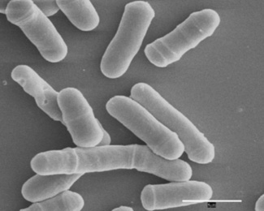
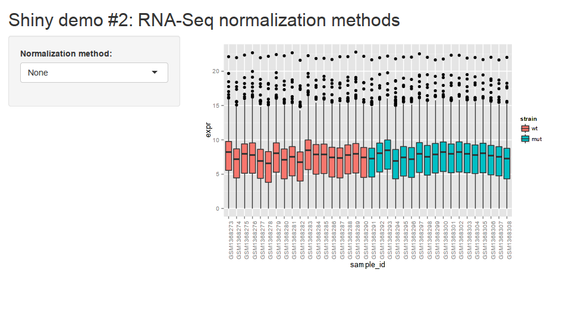

Shiny demo #2: RNA-Seq normalization
====================================

Overview
--------


(Source: [Wikipedia](http://en.wikipedia.org/wiki/Schizosaccharomyces_pombe#mediaviewer/File:Fission_yeast.jpg))

In this demo, a Shiny app is constructed to allow users to explore the impacts 
of various normalization methods on RNA-Seq data.

The two methods compared are:

- Size factor normalization (using
    [DESeq](http://bioconductor.org/packages/release/bioc/html/DESeq.html))
- Quantile normalization


A publically available [fission yeast time series
dataset](http://bioconductor.org/packages/release/data/experiment/vignettes/fission/inst/doc/fission.html)
is used for the demonstration. You can read more about the original experiment
[here](http://www.ncbi.nlm.nih.gov/pubmed/24853205).

One thing to note with this demo compared to the previous one is the use of
[reactive expressions](http://shiny.rstudio.com/tutorial/lesson6/). There are
a couple variables in `server.R` which are defined using the `reactive()`
function. The effect of this is that the values of the variables will be
cached, and the expressions will only be re-evaluated when something they
depend on changes. In this case, the selection of differing normalization
methods using the select box triggers both of the reactive expressions to be
re-evaluated. The `renderPlot()` function used to create the output plot is
also implicitly reactive and is re-run each time its underlying data changes.

Usage
-----



To run this demo, open up an R console in the directory containing `server.R`
and `ui.R` and type:

```r
library(shiny)
runApp()
```

