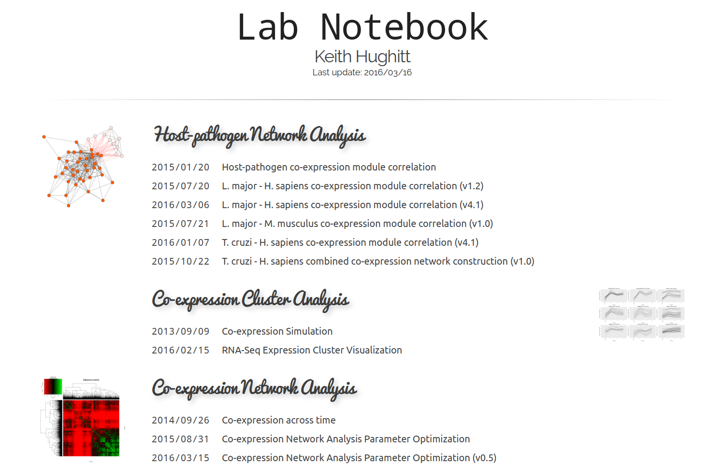

Labnote - A light-weight HTML lab notebook generator
====================================================

Labnote is a small tool I wrote to generate HTML lab notebooks from a
collection of analysis outputs, scripts, etc.

It plays particularly well with:

1. [knitr](http://yihui.name/knitr/)
2. [Jupyter Notebook](http://jupyter.org/)

Both of which are capable of outputting HTML with code and figures embedded.

Neither of these are required though and Labnote should be compatible with a
wide range of directory structures and file formats.

For more information, and to see a working example, check out:

1. [Labnote Github repo](https://github.com/khughitt/labnote)
2. [Labnote documentation](labnote.readthedocs.org)

