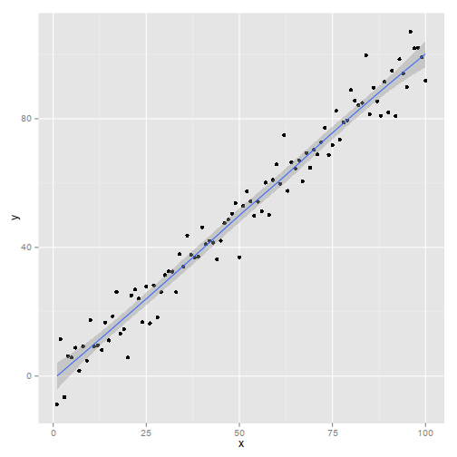

% Reproducible Research Using Knitr/R
% [Keith Hughitt](mailto:khughitt@umd.edu)
% 2013/09/03

Reproducible Research Using Knitr/R
===================================

Overview
--------

This brief tutorial will describe some best practices for using [R](http://www.r-project.org/),
knitr, and a couple other related tools for reproducible research.

### Why knitr?
[Knitr](http://yihui.name/knitr/) is a package for R which allows you to write
documents that combine R code with text written in another language such as
[LaTeX](http://www.latex-project.org/) or [Markdown](http://daringfireball.net/projects/markdown/).
Knitr then processes the document, running the R code portions and embedding
the results in the document, making it easy to generate elegant looking reports
in a variety of formats such as Markdown, HTML, and PDF. Unlike the traditional
approach where figures are generated separately from the rest of a manuscript,
knitr makes it easy to combine all of these elements in such a way so that
another scientist can easily reconstruct the entire manuscript from scratch.

Prerequisites
--------------

The main prerequisite for this tutorial is that at least part of your analysis
is being performed in R. Some excellent tools exist to achieve a similar effect
in other programming languages (e.g. [IPython Notebook](http://www.youtube.com/watch?v=F4rFuIb1Ie4)),
and some of the general practices discussed are relevant regardless of what
programming language you are working with, but parts of the tutorial assume
that you are working with R.

To get started, let's load up an R console and install and load a few useful
packages:


```r
install.packages(c("devtools", "knitr", "ggplot2"), dependencies = TRUE)
library(devtools)
library(knitr)

install_github("knitcitations", "cboettig")
library(knitcitations)
```

Although knitr has support for embedding R code in a number of popular
languages, this tutorial focuses on one particular markup language, Markdown,
which has a clear and simple syntax, and is supported by many other useful
tools such as Github.

Development Environment
-----------------------
No special development environment is actually needed to work create knitr
documents: any text-editor will work. If you are familiar with [RStudio](http://www.rstudio.com),
however, there is [built-in support](http://www.rstudio.com/ide/docs/authoring/using_markdown)
or compiling RMarkdown documents written using the knitr syntax.

The Basics
----------

The basic structure of an RMarkdown knitr document is to have block of R code,
surrounded by Markdown text.

### 1. A simple example

**Code**

    Here is some *text* written in [Markdown](http://daringfireball.net/projects/markdown/)
    followed by a short block of R code.
    
    ```{r}
    print("Hello World")
    ```
    
    Some more text can then follow the code block.

**Output**

Here is some *text* written in [Markdown](http://daringfireball.net/projects/markdown/)
followed by a short block of R code.


```r
print("Hello World")
```

```
## [1] "Hello World"
```


Some more text can then follow the code block.

As you can see, the Markdown formatting in the first sentence has been applied,
and the R code, in this case a simple print statement, has been evaluated, and
the results appending in a quote block following the command.

Although the example is trivial, you can already start to image how this could
be useful by including the output of more complex calculations along-side of
some explanatory text.

Things get much more interesting, however, when we start to look at how
plotting is handled by Knitr.

### 2. A plotting example

Using the same syntax as above, you can also embed plots directly in the output.

For example:

**Code**

    ```{r, plot_example, fig.width=8, fig.height=8, fig.dpi=96}
    library(ggplot2)
    set.seed(1)
    x = seq(1, 100)
    y = x + rnorm(100, sd=5)

    qplot(x, y) + geom_smooth(aes(x, y))
    ```
**Output**


```r
library(ggplot2)
set.seed(1)
x = seq(1, 100)
y = x + rnorm(100, sd = 5)

qplot(x, y) + geom_smooth(aes(x, y))
```

```
## geom_smooth: method="auto" and size of largest group is <1000, so using
## loess. Use 'method = x' to change the smoothing method.
```

 


For the above example, the figure is generated and saved as a PNG in the
`figure` directory. The plot is then referenced in the resulting Markdown, etc.
output file so that the image appears directly after the code used to generate
the image.

[Chunk options](http://yihui.name/knitr/options#chunk_options) allow you to
control various aspects of the code block. In the above example we specified
a desired figure width, height, and DPI; other options provide a way to control
the verbosity of the code output, skip blocks, etc.'

Notice also in the above example the 'plot_example' string that was added to
opening line of the R code block. This is simply an identifier that we can
give to that particular block or "chunk" of R code. It is not necessary to
give a code chunk an identifier, but it can be helpful for identifying problems
down the road, and also results in more descriptive filenames for the plot
images.

Finally, whenever parts of your analysis include a random component, such as
drawing from the Normal distribution above, it is a good practice to set a
known seed: otherwise it is very unlikely that someone else running your code
will arrive at the same results.

### 3. Running code written in another language

Another useful feature of knitr is the ability to run [code written in other
languages besides R](http://yihui.name/knitr/demo/engines/).

For example, you can include a [Bash](http://en.wikipedia.org/wiki/Bash_(Unix_shell))
chunk to execute arbitrary shell commands, including other software and scripts.
Similar to above, all of the output of those commands will be appended to the
knitted report.

**Code**

    ```{r bash_example, engine='bash'}
    bowtie2 --version
    ```

**Output**


```bash
bowtie2 --version
```

```
## /usr/bin/bowtie2-align version 2.1.0
## 64-bit
## Built on Europa
## Sat May  4 07:20:58 EDT 2013
## Compiler: gcc version 4.8.0 20130425 (prerelease) (GCC) 
## Options: -O3 -m64 -msse2 -funroll-loops -g3 
## Sizeof {int, long, long long, void*, size_t, off_t}: {4, 8, 8, 8, 8, 8}
```


### 4. What else can knitr do?

Hopefully the above examples provide an idea of some of the basic functionality
of knitr.

Knitr is actually capable of much more, however. For example, you can embed
LaTeX commands, images, and movies, and conditionally include child knitr
documents.

A full list of features is available in the [knitr documentation](http://yihui.name/knitr/options).
An [extensive repository of knitr examples](https://github.com/yihui/knitr-examples)
written in Markdown, LaTeX, HTML, etc is also available on Github.

Finally, several other tools exist which can serve to extend the functionality
of knitr. One such tool, described below, is knitcitations. Another useful
tool for working with the output knitr is [Pandoc](http://johnmacfarlane.net/pandoc/).
Pandoc is a universal document converter, capable of converting between formats
such as LaTeX, Markdown, docx, etc. Especially useful is the ability to go
from RMarkdown to PDF. For example, to convert this tutorial into a PDF, one
could simply do:

    pandoc README.md -o reproducible_research.pdf

Pandoc also has it's own syntax which can be combined with knitr's to produce
even nicer results. For example, to create an elegant-looking title page in
the Pandoc output, you could include a short comment block at the top of
the Markdown file with the following format:

    % Reproducible Research Using Knitr/R
    % [Keith Hughitt](mailto:khughitt@umd.edu)
    % 2013/09/03

Knitcitations
-------------

Another useful tool for writing manuscripts directly in Knitr is the
[knitcitations package](https://github.com/cboettig/knitcitations).
Knitcitations makes it easy to build up and display a bibliography with just 
the relevant [DOIs](http://en.wikipedia.org/wiki/Digital_object_identifier).

**Code**

    ```{r knit_citations}
    library(knitcitations)
    cleanbib()
    citep('10.1126/science.1213847')
    citep('10.1093/biostatistics/kxq029')
    bibliography()
    ```

**Output**


```r
library(knitcitations)
cleanbib()
citep("10.1126/science.1213847")
```

```
## [1] "(<a href=\"http://dx.doi.org/10.1126/science.1213847\">Peng, 2011</a>)"
```

```r
citep("10.1093/biostatistics/kxq029")
```

```
## [1] "(<a href=\"http://dx.doi.org/10.1093/biostatistics/kxq029\">Diggle & Zeger, 2010</a>)"
```

```r
bibliography()
```

```
## 
## - P. J. Diggle, S. L. Zeger,   (2010) Editorial.  *Biostatistics*  **11**  375-375  [10.1093/biostatistics/kxq029](http://dx.doi.org/10.1093/biostatistics/kxq029)
## - R. D. Peng,   (2011) Reproducible Research in Computational Science.  *Science*  **334**  1226-1227  [10.1126/science.1213847](http://dx.doi.org/10.1126/science.1213847)
```


Which, when embedded in a Markdown document, looks like:

- P. J. Diggle, S. L. Zeger,   (2010) Editorial.  *Biostatistics*  **11**  375-375  [10.1093/biostatistics/kxq029](http://dx.doi.org/10.1093/biostatistics/kxq029)
- R. D. Peng,   (2011) Reproducible Research in Computational Science.  *Science*  **334**  1226-1227  [10.1126/science.1213847](http://dx.doi.org/10.1126/science.1213847)

Best Practices for Reproducible Research
----------------------------------------

Although there has already been [a lot](http://www.youtube.com/watch?v=7gYIs7uYbMo)
of [discussion](http://simplystatistics.org/2013/08/21/treading-a-new-path-for-reproducible-research-part-1/)
recently on [reproducible research](http://ivory.idyll.org/blog/research-software-reuse.html),
I thought I would put together a short list of "best practices".

### 1. Make your data and code available

This is a pretty obvious first step, but people are going to have a difficult
time reproducing your results if they are missing either the code or data.
Making both of these available in public repositories is already a big first
step towards making it easy for other scientists to reproduce your work.

If you are able to share the code used for the analysis openly, then [Github](github.com)
is an excellent free repository that can be used to host your code.  Moreover,
Github's built-in support for displaying Markdown makes it especially useful for
knitr-based workflows. The present tutorial, for example, is [hosted on Github](https://github.com/umd-byob/byob/blob/master/presentations/2013/0903-knitr_reproducible_research).

### 2. Make all steps of the analysis transparent

The second important factor to make research clear and reproducible is to
make all of the different steps of the analysis as transparent as possible.

At a minimum, provenance information should be included for any datasets used
in the analysis. Further, if possible, all steps used to prepare the data,
however mundane, should also be included directly in the workflow.

Finally, if certain steps in the middle of the analysis involve calling external
scripts that you wrote, consider including those scripts inline in a knitr 
block, or at the very least, include the code for those scripts with your final
document.

### 3. Describe the environment used to perform the analysis

In addition to describing any hardware used to collect data, where relevant,
the software environment used to perform the analysis should also be described
thoroughly. This includes information about the OS, software versions, and
library versions.

Fortunately, knitr makes this especially easy since it can collect much of this
information for you.

See the `System Information` section below for an example of how this can be
performed.

### 4. Be less random

Set a seed for the random number generator in R or whichever language you are
using. As described above, the `set.seed()` function can be used in R to
achieve this.

Summary
-------

That's it! Hopefully this tutorial provided you with an idea of some of
tools and practices that can be used to make your research as easily 
reproducible as possible.

With that, I'll leave you with this story of some of the dangers of *non*-reproducible
research.

[](http://www.youtube.com/watch?v=7gYIs7uYbMo)


System Information
------------------


```r
system("uname -a")
system("python --version")
sessionInfo()
```

```
## R version 3.0.1 (2013-05-16)
## Platform: x86_64-unknown-linux-gnu (64-bit)
## 
## locale:
##  [1] LC_CTYPE=en_US.UTF-8       LC_NUMERIC=C              
##  [3] LC_TIME=en_US.UTF-8        LC_COLLATE=en_US.UTF-8    
##  [5] LC_MONETARY=en_US.UTF-8    LC_MESSAGES=en_US.UTF-8   
##  [7] LC_PAPER=C                 LC_NAME=C                 
##  [9] LC_ADDRESS=C               LC_TELEPHONE=C            
## [11] LC_MEASUREMENT=en_US.UTF-8 LC_IDENTIFICATION=C       
## 
## attached base packages:
## [1] stats     graphics  grDevices utils     datasets  methods   base     
## 
## other attached packages:
## [1] knitcitations_0.5-0 bibtex_0.3-6        ggplot2_0.9.3.1    
## [4] knitr_1.4.1         colorout_1.0-0      vimcom_0.9-8       
## [7] setwidth_1.0-3     
## 
## loaded via a namespace (and not attached):
##  [1] colorspace_1.2-2   dichromat_2.0-0    digest_0.6.3      
##  [4] evaluate_0.4.7     formatR_0.9        grid_3.0.1        
##  [7] gtable_0.1.2       httr_0.2           labeling_0.2      
## [10] markdown_0.6.3     MASS_7.3-26        munsell_0.4.2     
## [13] plyr_1.8           proto_0.3-10       RColorBrewer_1.0-5
## [16] RCurl_1.95-4.1     reshape2_1.2.2     scales_0.2.3      
## [19] stringr_0.6.2      tools_3.0.1        XML_3.98-1.1      
## [22] xtable_1.7-1
```


References
==========
- Carl Boettiger,   (2013) knitcitations: Citations for knitr markdown files.  [https://github.com/cboettig/knitcitations](https://github.com/cboettig/knitcitations)
- Yihui Xie,   (2013) knitr: A general-purpose package for dynamic report generation in R.  [http://yihui.name/knitr/](http://yihui.name/knitr/)
- Yihui Xie,   (2013) Dynamic Documents with {R} and knitr.  [http://yihui.name/knitr/](http://yihui.name/knitr/)
- Yihui Xie,   (2013) knitr: A Comprehensive Tool for Reproducible Research in {R}.  [http://www.crcpress.com/product/isbn/9781466561595](http://www.crcpress.com/product/isbn/9781466561595)>

Aknowledgements
===============
I would like to thank the authors of knitr and knitcitations, Yihui Xie and 
Carl Boettiger, for their hard work on these excellent tools, and also for
[taking](https://groups.google.com/forum/#!topic/knitr/4uIVaLMGpKQ)
[the](https://groups.google.com/forum/#!topic/knitr/1J8e6JwvBcQ) [time](https://groups.google.com/forum/#!topic/knitr/yg_WnFTUWTc)
to answer questions from pestering knitr newbies.

Keep up the good work!

